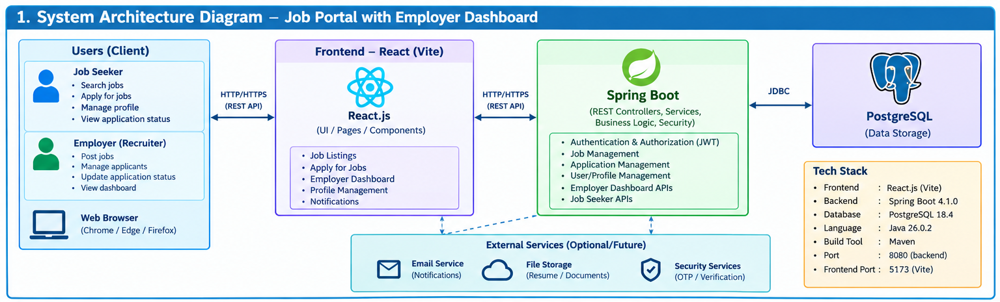
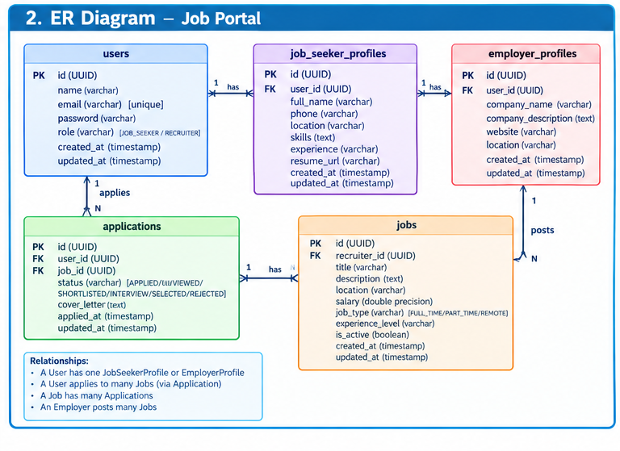
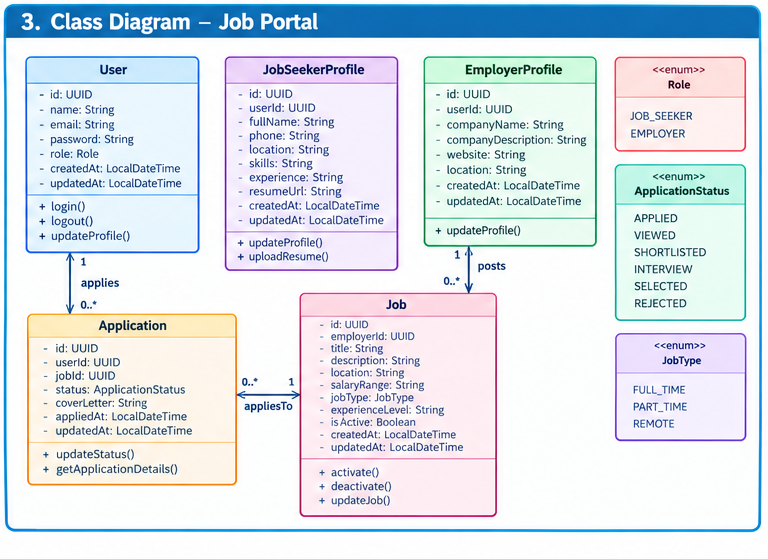

# 💼 JobPortal – Online Job Portal

## 📌 Project Overview

JobPortal is a web-based job portal application that connects job seekers with recruiters.

Job seekers can register, login, search for jobs, upload resumes, apply for jobs, and track their application status.

Recruiters can register, login, post jobs, edit jobs, delete jobs, view applicants, and update application status.

---

## 🎯 Objectives

- Provide an easy-to-use online job searching platform
- Allow recruiters to post and manage job opportunities
- Allow job seekers to search and apply for jobs
- Allow job seekers to upload resumes
- Allow recruiters to view applicant details and resumes
- Track application status

---

## 🚀 Features

### 👨‍💻 Job Seeker

- Register and Login
- Upload Resume
- Search Jobs
- Filter Jobs by Location
- Filter Jobs by Minimum Salary
- View Job Details
- Apply for Jobs
- View My Applications
- Track Application Status
- Withdraw Applications

### 👨‍💼 Recruiter

- Register and Login
- Post New Jobs
- Edit Job Postings
- Delete Job Postings
- View Job Applicants
- View Applicant Resume
- Update Application Status
  - APPLIED
  - SHORTLISTED
  - REJECTED

---

## 🛠️ Technologies Used

### Frontend

- React.js
- JavaScript
- HTML
- CSS

### Backend

- Java
- Spring Boot
- Spring Data JPA
- Spring Security
- JWT Authentication
- REST API

### Database

- PostgreSQL

### Tools

- Visual Studio Code
- Git
- GitHub
- Maven

---

## 🏗️ Project Structure

```text
JobPortal
│
├── jobportal
│   └── Spring Boot Backend
│
├── jobportal-frontend
│   └── React Frontend
│
├── docs
│   ├── diagrams
│   │   ├── architecture-diagram.png
│   │   ├── er-diagram.png
│   │   └── class-diagram.png
│   │
│   └── Problem_Statement.md
│
├── README.md
├── .gitignore
├── LICENSE
├── .env.example
└── CHANGELOG.md

```

##🏛️ System Architecture

The application follows a three-layer web architecture:

Frontend: React.js application
Backend: Spring Boot REST API
Database: PostgreSQL

The frontend communicates with the backend through REST APIs. The backend handles authentication, business logic, and database operations.

### Architecture Diagram



##🗃️ Database Design

The main entities of the JobPortal application are:

User
Job
Application
Job Seeker Profile

Users can act as job seekers or recruiters.

Recruiters can create job postings, while job seekers can apply for jobs. Applications connect job seekers with jobs and contain application status information.

### ER Diagram



##📦 Class Design

The backend uses Java classes and Spring Boot components to implement the application.

The main classes represent:

User
Job
Application
Job Seeker Profile
Controllers
Services
Repositories
Security components

### Class Diagram




##🔄 Application Workflow

Job Seeker Workflow

###Register
   ↓
Login
   ↓
Search Jobs
   ↓
View Job Details
   ↓
Apply for Job
   ↓
Track Application Status
   ↓
Withdraw Application (if required)


###Recruiter Workflow

Register
   ↓
Login
   ↓
Post Job
   ↓
Manage Job
   ↓
View Applicants
   ↓
Update Application Status


##▶️ How to Run the Project

1. Clone the Repository
git clone <YOUR_GITHUB_REPOSITORY_URL>

Navigate into the project:

cd JobPortal

2. Run the Backend

Open a terminal and navigate to the backend folder:

cd jobportal

Run the Spring Boot application:

./mvnw.cmd clean spring-boot:run

The backend runs on:

http://localhost:8080


3. Run the Frontend

Open another terminal.

Navigate to the frontend folder:

cd jobportal-frontend

Install dependencies:

npm install

Start the React development server:

npm run dev

The frontend runs on:

http://localhost:5173


##🗄️ Database Configuration

The application uses PostgreSQL.

Create a database named:

jobportal

Configure the database connection in the Spring Boot application configuration.

Example:

spring.datasource.url=jdbc:postgresql://localhost:5432/jobportal
spring.datasource.username=YOUR_USERNAME
spring.datasource.password=YOUR_PASSWORD

Do not commit real database passwords or secret credentials to GitHub.


##🔐 Authentication

The application provides role-based authentication for:

Job Seekers
Recruiters

Authentication is implemented using:

Spring Security
JWT
BCrypt password hashing

Protected operations require authenticated users with the appropriate role.


##📄 Resume Upload

Job seekers can upload their resumes while using the application.

Supported resume formats include:

PDF
DOC
DOCX

Recruiters can view applicant resume information from the applicant section.


##📊 Application Status

Recruiters can update the status of job applications.

Available statuses include:

APPLIED
SHORTLISTED
REJECTED

Job seekers can view their application status from their dashboard.


##🧪 Testing

The application can be tested by running the backend and frontend locally and verifying:

User registration
User login
Job creation
Job search
Job application
Resume upload
Application status updates
Application withdrawal
Recruiter job management


##📚 Documentation

Project documentation is available in the docs folder.

docs/
├── diagrams/
│   ├── architecture-diagram.png
│   ├── er-diagram.png
│   └── class-diagram.png
│
└── Problem_Statement.md


##📈 Future Enhancements

The project can be further enhanced with:

Smart job matching
Skill-gap analysis
Job and recruiter verification
Application notifications
Salary transparency
Duplicate job detection
Expired job detection
Recruiter-candidate matching
Improved application tracking


##👩‍💻 Author

Priya B.

B.Tech Artificial Intelligence and Data Science


##📜 License

This project is developed for educational and academic purposes.