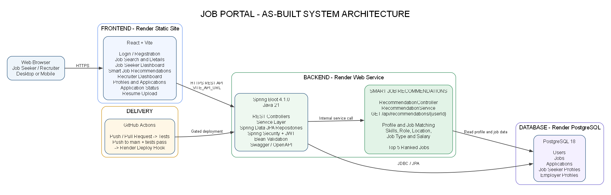
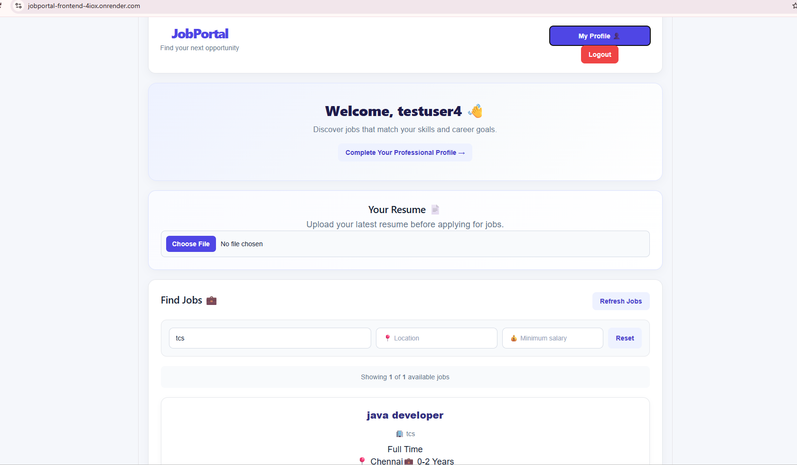
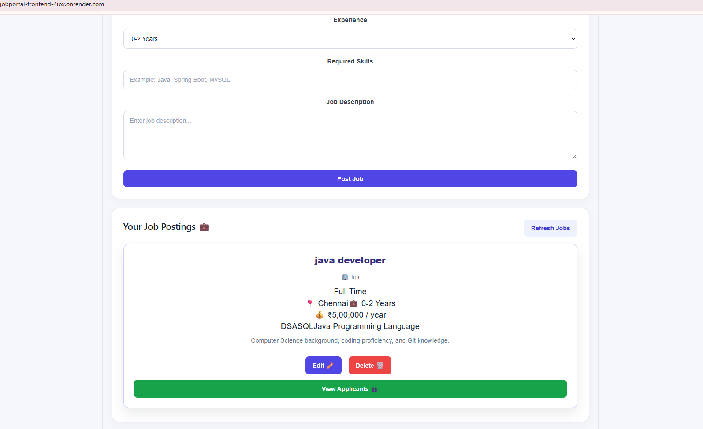

# Job Portal with Employer Dashboard

*A full-stack recruitment platform built with Spring Boot, React, PostgreSQL, and JWT authentication.*

## Live Demo and Video Demo

* **Live application:** https://jobportal-frontend-4iox.onrender.com
* **Backend API:** https://jobportal-6ib1.onrender.com
* **GitHub repository:** https://github.com/preeyaahh29-droid/jobportal

**Video demo (2–4 minutes):** Pending recording. Replace this line with the final video URL before submission.

## Overview

Job Portal with Employer Dashboard is a full-stack web application that supports separate workflows for Job Seekers and Recruiters. Job Seekers can search for jobs, manage their profiles, upload resumes, apply for jobs, and track application statuses, while Recruiters can manage job listings and applications. The Smart Job Recommendations enhancement ranks up to five jobs using a job seeker's skills and profile preferences. A React frontend communicates with a Spring Boot REST API backed by PostgreSQL.

## Architecture Diagram

The diagram below shows the deployed frontend, backend, database, delivery workflow, and Smart Job Recommendations integration.



Editable diagram source: [`docs/diagrams/architecture.dot`](docs/diagrams/architecture.dot).

## Tech Stack

| Layer                       | Technologies                           |
| --------------------------- | -------------------------------------- |
| Backend                     | Java 21, Spring Boot 4.1.0, Spring Web |
| Persistence                 | Spring Data JPA, Hibernate             |
| Authentication and security | Spring Security, JWT, BCrypt           |
| Database                    | PostgreSQL                             |
| Frontend                    | React, Vite, JavaScript, HTML, CSS     |
| Testing                     | JUnit 5, Mockito, Spring Boot Test     |
| Build tools                 | Maven, npm                             |
| CI/CD                       | GitHub Actions                         |
| Deployment                  | Render                                 |
| Container support           | Docker                                 |

## Features

### Job Seeker

* Register and log in using JWT authentication.
* Browse available jobs and search or filter listings.
* View job details.
* Manage a job-seeker profile.
* Upload resumes in PDF, DOC, and DOCX formats.
* Apply for jobs and avoid duplicate applications.
* View submitted applications and withdraw applications.
* Track application status.

### Smart Job Recommendations

* Get up to five ranked job recommendations.
* Score jobs using profile and job criteria such as skills, preferred role, location, job type, and salary.
* Display match percentages, matched skills, and missing skills.
* Open a recommended job's details from the Job Seeker dashboard.

### Recruiter

* Register and log in using JWT authentication.
* Create, update, and delete job listings.
* View recruiter-owned jobs.
* View applicants for jobs.
* Update application statuses.
* Create and update an employer profile.
* Access applicant resumes through the application workflow.

### Application Status

Supported application stages include:

`APPLIED`, `VIEWED`, `SHORTLISTED`, `INTERVIEW`, `SELECTED`, and `REJECTED`.

### Security

* JWT-based authentication.
* Spring Security authorization.
* Job Seeker and Recruiter roles.
* BCrypt password hashing.
* Protected resume access.
* Recruiter ownership checks.
* CORS configuration for the frontend.
* Database credentials and JWT secrets supplied through configuration rather than committed to source control.

## Screenshots

### Job Seeker Dashboard



### Recruiter Dashboard



## Getting Started

### Prerequisites

Install the following tools:

* Java 21
* PostgreSQL
* Node.js and npm
* Git

### 1. Clone the repository

```bash
git clone https://github.com/preeyaahh29-droid/jobportal.git
cd jobportal
```

### 2. Create the local database

Create a PostgreSQL database named `jobportal` using pgAdmin or the PostgreSQL command line.

```sql
CREATE DATABASE jobportal;
```

### 3. Configure the backend

Set environment variables in the same PowerShell terminal where you will start the backend. Replace the example values with your local configuration; do not commit real passwords or secrets.

```powershell
$env:SPRING_DATASOURCE_URL = "jdbc:postgresql://localhost:5432/jobportal"
$env:SPRING_DATASOURCE_USERNAME = "postgres"
$env:SPRING_DATASOURCE_PASSWORD = "YOUR_LOCAL_POSTGRES_PASSWORD"
$env:JWT_SECRET = "REPLACE_WITH_A_LONG_RANDOM_SECRET"
$env:SERVER_PORT = "8080"
```

Start the backend from the project root:

```powershell
.\mvnw.cmd spring-boot:run
```

The backend runs at `http://localhost:8080`.

### 4. Configure and start the frontend

Open a second terminal:

```powershell
cd jobportal-frontend
npm.cmd install
```

For local development, the frontend uses `http://localhost:8080` as its API URL when no other API URL is configured. You can set it explicitly before starting Vite:

```powershell
$env:VITE_API_URL = "http://localhost:8080"
npm.cmd run dev
```

The frontend runs at `http://localhost:5173`.

### 5. Open the application

Visit `http://localhost:5173` in your browser and register or log in using the application's authentication flow.

## Environment Variables

Configure these variables in the relevant runtime or hosting service. Never publish real passwords or signing secrets.

| Variable                     | Description                                                                                           | Required                        |
| ---------------------------- | ----------------------------------------------------------------------------------------------------- | ------------------------------- |
| `SPRING_DATASOURCE_URL`      | PostgreSQL JDBC connection URL                                                                        | Yes                             |
| `SPRING_DATASOURCE_USERNAME` | Database username                                                                                     | Yes                             |
| `SPRING_DATASOURCE_PASSWORD` | Database password                                                                                     | Yes                             |
| `JWT_SECRET`                 | Secret used for JWT authentication                                                                    | Yes                             |
| `SERVER_PORT`                | Backend application port; normally `8080` locally                                                     | No                              |
| `FRONTEND_URL`               | Allowed frontend origin used by backend CORS configuration; local fallback is `http://localhost:5173` | Yes in production               |
| `VITE_API_URL`               | Backend API base URL used by the frontend build                                                       | Yes in deployment configuration |
| `PORT`                       | Port supplied by the hosting platform when applicable                                                 | Platform-dependent              |

The `.env.example` file provides example names and local configuration values. A `.env.example` file is a template; it does not itself configure a running application.

## API Documentation

The deployed backend provides API documentation through Swagger UI and an OpenAPI specification.

* **Swagger UI:** https://jobportal-6ib1.onrender.com/swagger-ui/index.html
* **OpenAPI specification:** https://jobportal-6ib1.onrender.com/v3/api-docs
* **Backend health endpoint:** `GET /api/health`

### Smart Job Recommendations API

| Method | Endpoint                        | Purpose                                        |
| ------ | ------------------------------- | ---------------------------------------------- |
| GET    | `/api/recommendations/{userId}` | Retrieve ranked job recommendations for a user |

The endpoint requires JWT authentication under the current Spring Security configuration. See [`docs/diagrams/api-contract.md`](docs/diagrams/api-contract.md) for the project API contract.

## Running Tests

Run the backend test suite from the project root:

```powershell
.\mvnw.cmd clean test
```

**Latest verified local backend result after the enhancement:**28 tests run, 0 failures, 0 errors, and 0 skipped.

The test suite includes the new recommendation-service tests and existing application-service tests.

To verify the frontend production build:

```powershell
cd jobportal-frontend
npm.cmd install
npm.cmd run build
```

The frontend production build has also completed successfully.

## Deployment

The application is deployed to Render.

| Component           | Platform           |
| ------------------- | ------------------ |
| React frontend      | Render Static Site |
| Spring Boot backend | Render Web Service |
| Database            | Render PostgreSQL  |

### Continuous integration and deployment

The GitHub Actions workflow is located at `.github/workflows/ci.yml`.

* Pull requests and pushes to `main` trigger backend validation and tests according to the workflow.
* The deployment step is intended to run from `main` after the required tests pass.
* Production configuration, database credentials, and JWT secrets must be configured in the hosting environment rather than committed to GitHub.

Live URLs:

* Frontend: https://jobportal-frontend-4iox.onrender.com
* Backend: https://jobportal-6ib1.onrender.com

The Smart Job Recommendations enhancement has been merged into `main` and verified on the live application.

## Folder Structure

```text
jobportal/
├── .github/
│   └── workflows/
│       └── ci.yml
├── docs/
│   ├── diagrams/
│   │   ├── architecture.dot
│   │   ├── architecture-diagram.png
│   │   ├── class-diagram.png
│   │   ├── er-diagram.png
│   │   └── api-contract.md
│   ├── screenshots/
│   ├── application-workflow.png
│   └── Problem_Statement.md
├── src/
│   ├── main/
│   │   └── java/com/jobportal/jobportal/
│   │       ├── controller/
│   │       ├── dto/
│   │       ├── entity/
│   │       ├── repository/
│   │       ├── security/
│   │       └── service/
│   └── test/
├── jobportal-frontend/
│   └── src/
├── Enhancement_Proposal.md
├── CHANGELOG.md
├── Dockerfile
├── pom.xml
├── .env.example
├── LICENSE
└── README.md
```

## Future Enhancements

* Add email notifications for application-status changes.
* Improve job search filters and matching preferences.
* Add saved jobs and application reminders.
* Expand recommendation evaluation with additional tests and explainable match factors.
* Improve pagination and reporting for larger job and application lists.

## License

This project is licensed under the MIT License. See [`LICENSE`](LICENSE) for details.

## Author / Contact

**Developer:** Priya B.

**GitHub repository:** https://github.com/preeyaahh29-droid/jobportal
